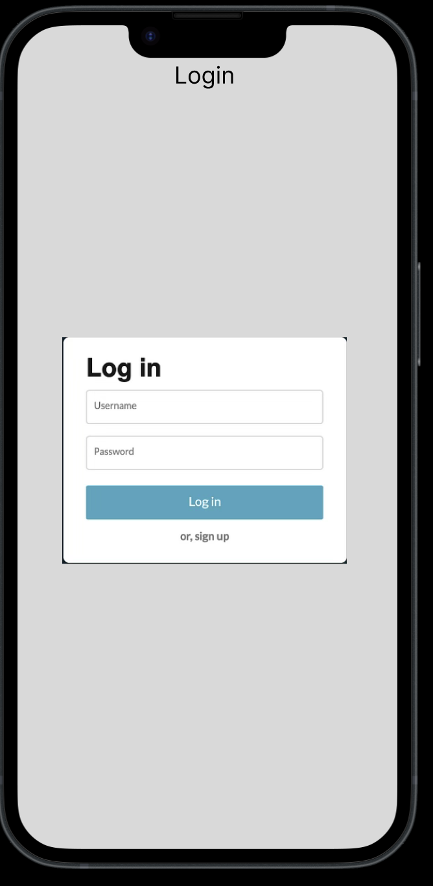
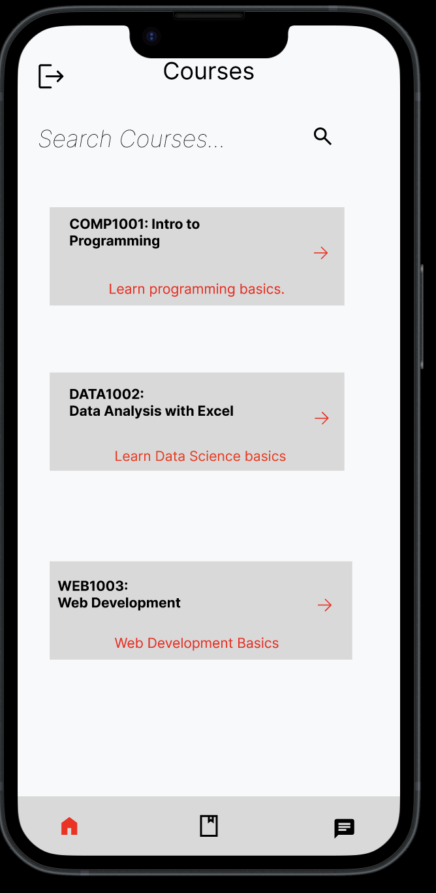
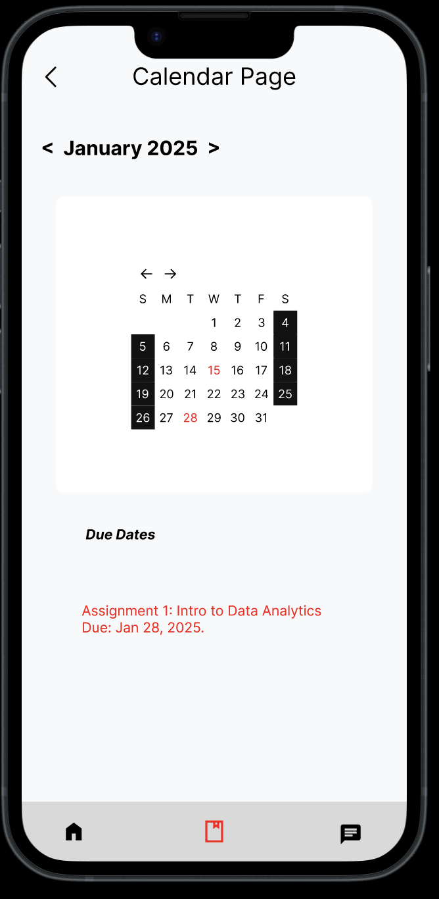
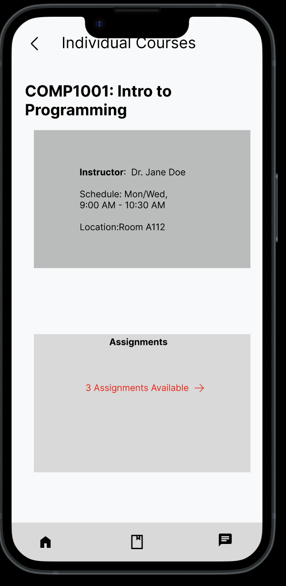
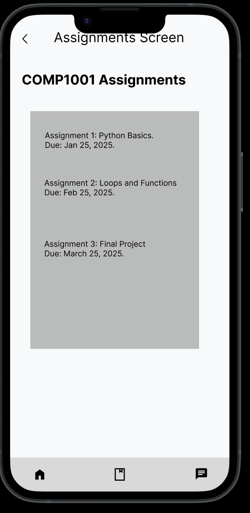
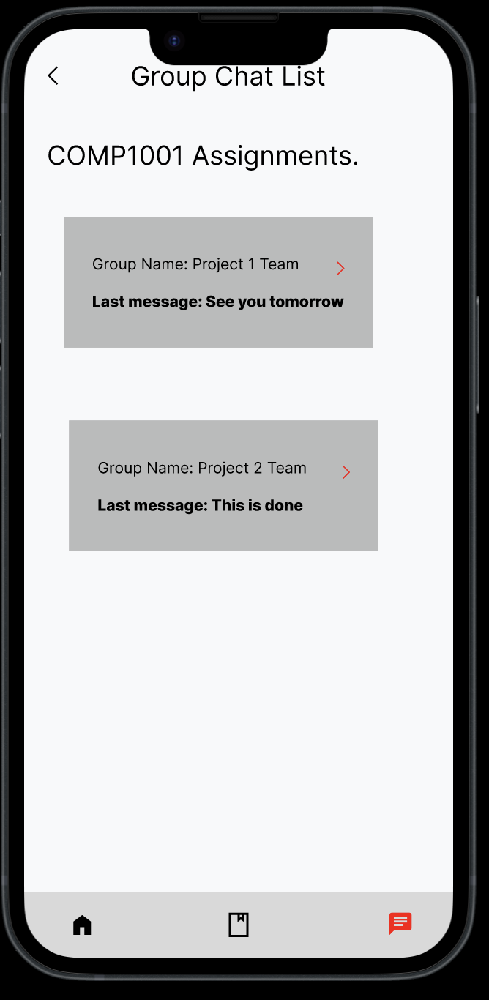
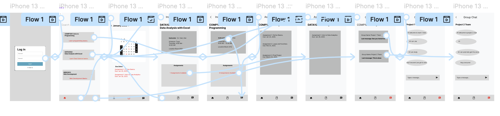

# HCI-Assignment-2-y3s2

# Course Companion App

Documentation and prototype for the **Course Companion App**, an educational platform designed to help students efficiently manage their courses, assignments, and group communications. 

## Application Versions

1. [Prototype Version 1 (Figma)](https://www.figma.com/design/d3XK3rT4BrGbcPpES8ZuAI/Assignment-2Part-3?node-id=0-1&t=pUfqVD4cdLfzqzC1-1) 

## :thinking: About

The **Course Companion App** is designed to make course management easier by integrating key features like assignments, calendars, and group chat into a sleek and intuitive interface. It allows users to track their assignments, check due dates, collaborate with teams, and stay organized in one place.

## :fire: Features

- Login and Signup
- Browse and Search Courses
- View Individual Course Details (Instructor, Schedule, Location)
- Assignments Management
  - View assignments for each course
  - Due dates tracking
- Calendar Integration
  - View assignment due dates in a monthly calendar format
- Group Chat
  - Chat with group members for projects and discussions
  - Organized chat lists by course
- Clean and modern user interface

## Prototypes

### Login Screen

### Courses Page

### Calendar Integration

### Individual Course Page

### Assignment Overview

### Group Chats

### Individual Chat 

## :books: Navigation Prototype

## :film_projector: Demo Video

Watch the video [here]() 

## :bulb: Future Planning

For future development, we plan to include the following features:
| Issue                                    | Proposed Solution                                                                                   |
|------------------------------------------|-----------------------------------------------------------------------------------------------------|
| Assignment Overdue Alerts                | Notifications for overdue assignments to help students stay on top of deadlines.                   |
| Collaborative Assignment Boards          | A Kanban-style board for teams to track progress on assignments and projects.                      |
| Personalized Study Planner               | Automatically generate a study schedule based on assignment due dates and user preferences.        |
| Enhanced Group Chat                      | Add file-sharing, voice notes, and task assignment within group chats.                             |
| Dark Mode                                | Improve usability and accessibility for users working at night or in low-light environments.       |

## Links

- [GitHub Repository](https://github.com/igurvir/HCI-Assignment-2-y3s2) 
- [Figma Public Link](https://www.figma.com/design/d3XK3rT4BrGbcPpES8ZuAI/Assignment-2Part-3?node-id=0-1&t=pUfqVD4cdLfzqzC1-1) 
- [Demo Video](https://www.yourvideolink.com) 
